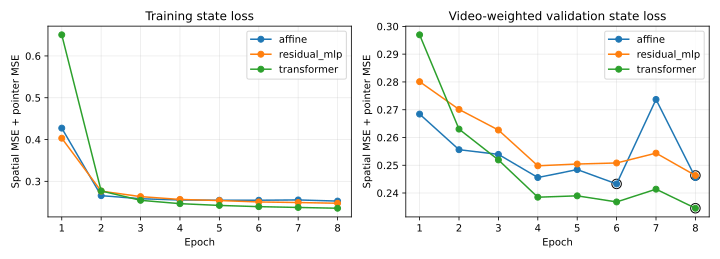

# Fit 1,000 pair 학습 후 Small→Base+ 평가

주 지표: 전환 후 처리 프레임 +1..+10 중 annotation이 있는 프레임의 J&F. 영상당 객체 하나·switch 하나이며 모든 8개 방법이 완료된 공통 영상만 사용한다. 전체 suffix는 보조 지표다. 점수·CI는 point 단위(0–100)다.

## 실제 규모와 split

| Dataset | 학습 pair / 영상 | Checkpoint 선택 pair / 영상 | 최종 평가 영상 | 이전 평가에 사용된 영상 |
|---|---:|---:|---:|---:|
| MOSEv2 | 500 / 500 | 100 / 100 | 40 | 34 |
| LVOSv2 | 500 / 250 | 100 / 75 | 40 | 35 |
| DAVIS2017 | — | — | 40 | 34 |
| VOST | — | — | 40 | 35 |

학습 1,000 pair(750영상), validation 200 pair(175영상)는 기존 fit pool만 사용했다. 유효 memory record는 학습 15,189개, validation 3,025개다. MOSE 영상당 1 pair, LVOS 영상당 최대 2 pair다. 학습·validation·최종 평가는 영상 단위로 분리했다. MOSE train/development, LVOS valid, DAVIS 2017 train, VOST val을 사용한다. DAVIS train은 탐색적 평가다. 이전 실험에서 평가한 영상도 포함하므로 전체를 untouched test라고 부르지 않는다. 영상별 이전 평가 이력과 길이 구간은 evaluation_cases.csv에 기록했다.

## 학습과 checkpoint

동일 seed 7, batch_records=4, 8 epoch, AdamW learning rate 0.001. Spatial MSE + pointer MSE를 학습하며 validation loss는 영상별 균등 평균이다. 세 모델을 새로 초기화했고 과거 translator checkpoint는 사용하지 않았다.

| 모델 | 선택 epoch | Validation loss | 파라미터 | 마지막 epoch가 최적 |
|---|---:|---:|---:|---|
| affine | 6 | 0.243274 | 69,952 | 아니오 |
| residual_mlp | 8 | 0.246315 | 279,488 | 예 |
| transformer | 8 | 0.234519 | 457,216 | 예 |

MLP와 Transformer는 epoch 8이 최적이므로 수렴이 확인되지 않았다. State loss가 낮다는 것만으로 segmentation 성능 우위를 뜻하지 않는다. Affine은 bias가 있는 Wx+b(69,952 parameters)이며 최소제곱 해가 아니라 AdamW 학습이다.

선택 가중치는 [Affine](../../training/run_fit1000_val200/affine.pt), [MLP](../../training/run_fit1000_val200/residual_mlp.pt), [Transformer](../../training/run_fit1000_val200/transformer.pt)에 보존하며 SHA-256은 training.json에 기록한다.

## 전환 직후 J&F 및 paired 차이

| Dataset | Small-only | Base+-native | Direct | Affine | MLP | Transformer | Last-mask | Replay-16 |
|---|---|---|---|---|---|---|---|---|
| MOSEv2 | 69.41 [58.61, 79.20] | 65.49 [53.99, 76.09] | 23.03 [12.66, 34.38] | 65.16 [53.99, 75.26] | 64.67 [53.03, 74.77] | 66.88 [55.84, 76.84] | 60.37 [48.41, 71.33] | 58.44 [46.10, 70.49] |
| LVOSv2 | 76.97 [65.60, 86.92] | 78.18 [67.02, 87.66] | 6.62 [0.15, 15.04] | 76.72 [65.33, 86.67] | 76.96 [65.52, 86.85] | 76.47 [65.25, 86.47] | 73.52 [61.48, 84.24] | 52.38 [38.09, 66.53] |
| DAVIS2017 | 88.52 [82.80, 92.88] | 88.91 [83.44, 93.25] | 6.47 [1.84, 12.33] | 86.10 [78.88, 91.86] | 88.01 [82.21, 92.65] | 87.60 [81.78, 92.29] | 83.54 [74.95, 90.63] | 87.36 [81.33, 92.30] |
| VOST | 55.46 [45.06, 65.59] | 54.34 [43.44, 65.49] | 10.55 [2.56, 20.13] | 58.02 [47.27, 68.17] | 57.29 [46.91, 67.47] | 54.47 [43.99, 64.78] | 57.59 [46.71, 67.77] | 46.47 [34.50, 58.78] |

같은 영상에서의 방법 차이를 video-paired bootstrap(2,000 draws, seed 7)으로 계산했다. CI가 0을 포함하면 해당 데이터셋의 우위가 확인된 것으로 해석하지 않는다.

여러 방법·데이터셋을 비교한 pointwise 95% CI이며 다중 비교 보정은 하지 않았다. 0을 근소하게 제외한 차이도 확정적인 일반화 결론으로 취급하지 않는다.

| Dataset | Affine−Direct | MLP−Affine | Transformer−Affine | Affine−Last-mask | Affine−Replay-16 |
|---|---|---|---|---|---|
| MOSEv2 | 42.13 [28.39, 56.23] | -0.49 [-3.09, 1.59] | 1.71 [0.06, 3.88] | 4.79 [0.71, 9.86] | 6.72 [-1.68, 16.67] |
| LVOSv2 | 70.11 [58.04, 81.87] | 0.24 [-0.16, 0.72] | -0.26 [-0.61, 0.03] | 3.20 [-0.52, 8.11] | 24.34 [11.03, 38.96] |
| DAVIS2017 | 79.63 [70.64, 88.00] | 1.91 [0.11, 5.33] | 1.50 [-0.43, 4.91] | 2.56 [-0.46, 7.94] | -1.26 [-5.52, 2.49] |
| VOST | 47.47 [31.55, 60.84] | -0.73 [-5.52, 6.20] | -3.55 [-9.47, 0.02] | 0.43 [-0.64, 1.61] | 11.55 [-2.21, 24.44] |

이번 8-epoch 조건에서 Affine의 Direct 대비 개선은 네 데이터셋 모두에서 확인됐다. Nonlinear의 이점은 데이터셋 의존적이다: MOSE의 Transformer는 +1.71 [0.06, 3.88], DAVIS의 MLP는 +1.91 [0.11, 5.33] point였으나 다른 데이터셋까지 일관된 우위는 없었다. MLP·Transformer의 최적 checkpoint가 마지막 epoch라는 한계도 함께 고려해야 한다.

Affine도 항상 Small-only보다 좋은 것은 아니다. MOSE에서는 평균 65.16 대 69.41이었다. 따라서 이 결과는 상태 변환의 효과를 보여주지만, Base+ 전환 자체가 항상 품질을 높인다는 뜻은 아니다.

+1..+10 각각의 J/F/J&F와 GT 누락 상태는 switch_frames.csv, 첫 10프레임 평균 J/F/J&F는 first10_J_F_JF.json, 전체 suffix·visible/absent/reappearance·사건 영상 수·CI는 summary.json에 제공한다. LVOS offset은 원본 5프레임, VOST는 6프레임 간격의 처리 프레임이다.

## 전환 비용과 검증

고정 smoke 12영상(데이터셋당 3영상)의 warm-model/cold-RGB 중앙값이다. 모델 load는 제외하며 video 초기화·export·이동·변환·주입·replay는 costs.json에 분리해 기록한다. 첫 출력 시간은 translator/restart/replay에서는 준비된 Small 상태부터이고 Base+-native/Full Replay에서는 전체 prefix 재처리부터다. VRAM은 PyTorch peak allocated memory이며 nvidia-smi 전체 사용량이 아니다.

Native·Small reference의 video 초기화는 prefix 시간에 포함돼 별도 값이 없으며 추정해 채우지 않았다. 전환 방법의 target video 초기화는 video_init_s로 별도 기록했다.

| 방법 | Handoff ms | Export + 첫 출력 ms | Replay ms | Peak allocated MiB |
|---|---:|---:|---:|---:|
| small_only | — | 1752.65 | — | 1157.71 |
| base_native | — | 1825.85 | — | 1247.98 |
| direct | 2.85 | 77.67 | 0.00 | 1196.31 |
| affine | 3.12 | 81.52 | 0.00 | 1196.31 |
| residual_mlp | 3.31 | 78.39 | 0.00 | 1196.31 |
| transformer | 3.84 | 81.83 | 0.00 | 1196.31 |
| last_mask | 49.79 | 95.14 | 49.77 | 1233.14 |
| anchor_replay_16 | 579.42 | 626.20 | 579.39 | 1252.56 |

Self-injection 160/160 통과: native full-logit hash 동일, max error 0, binary IoU 1. Direct/Affine/MLP/Transformer의 전환 준비 중 과거 backbone 호출 0, Replay-16은 원래 anchor + 최근 16프레임임을 모든 완료 case에서 확인했다.

본 실행의 실패 0건, 미완료 후보 0건. 준비 단계 smoke 실패 2건은 수정 전 provenance로 분리하고 setup_failures.json에 보존했으며 최종 점수에 포함하지 않았다. SAM2 _C 확장 누락으로 optional hole-fill 후처리를 생략한 환경이며 모든 방법에 동일하게 적용됐다.

세 모델 학습+validation 합계 101.44분, 단일 GPU 추가 평가 계측 127.32분. 여기에 초기 audit와 CPU 최종 집계 시간이 별도로 있다. 영상·방법·suffix를 줄여 사례 수를 늘리지 않았다. 확정 영상·pair 목록, 실행 순서, 원본 파일 hash, checkpoint hash와 결과 row는 이 폴더에 함께 보존한다.

## 기존 다운로드 state pair 재사용 점검

영상·객체·처리 switch가 일치한 후보 4개 중 현재 native continuation과 수치적으로 동일한 것으로 검증된 pair는 0개다. 상태 계약 및 full-suffix logit hash 점검은 downloaded_pair_reuse.json에 보존한다. 불일치는 이번 실행의 exact gate와 호환되지 않는다는 뜻이며, 모델 방향이 틀렸다는 결론이나 학습용 fit bank 자체가 잘못됐다는 결론은 아니다. 차이의 원인은 별도 검증하지 않았다.
